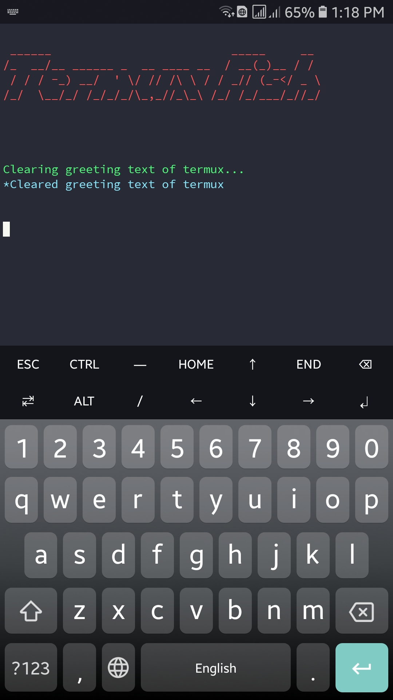

# Termux Fish
This program will (permanently) install fish(<b>f</b>riendly <b>i</b>nteractive <b>sh</b>ell) in termux and change the look of your termux homepage using neofetch. FISH has auto completion,syntax highlighting and many more features.
<br>
For more info check <a href="https://fishshell.com" target="_blank">this</a> out.
<br>
New look of termux:

<br><br>
The script:

<br><br>
<i>Simple one-liner command to do it all for you (recommended):</i>
```bash
pkg update && pkg upgrade -y && pkg install curl -y && curl -sSf "https://raw.githubusercontent.com/msn-05/termux-fish/main/script.sh" | sh
```
<br><br>
<i>Expressive approach</i>
1)Update termux:
```bash
pkg update && pkg upgrade -y
```
2)Install git
```bash
pkg install git -y
```
3)Clone this repo
```bash
git clone https://github.com/msn-05/termux-fish.git
```
4)Change dir to the repo and give executable permissions to script.sh
```bash
cd termux-fish && chmod +x script.sh
```
5)Run the script
```bash
./script.sh
```
6)Go back and delete downloaded repo
```bash
cd .. && rm -rf termux-fish
```
7)Exit termux and enter again.
<br><br>
If you want to revert back to your previous shell type this command:<br>
```bash
chsh -s bash
```
